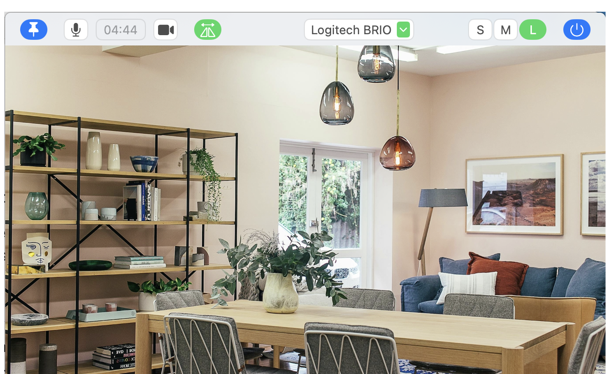

# MacRecordWidget

A macOS menu bar app for starting and stopping recordings without leaving
whatever you are working on.

It records two ways, one at a time: **audio** through the Shortcuts app into
Voice Memos, and **video** captured in-app, written straight into Photo Booth's
library. A live camera preview is always on below the controls.



<!-- TODO screenshots: docs/images/panel-recording.png (mic button red, dot blinking, timer running)
     and docs/images/menubar-icon.png (menu bar icon green while recording). -->

## Requirements

- macOS 14.0 or later
- **Two Shortcuts named exactly `Start` and `Stop`** that begin and end a Voice
  Memos recording. The app does not create these for you, and without them the
  audio button will appear to work while recording nothing.

No Accessibility permission is needed.

## Install

```bash
scripts/create-signing-cert.sh   # once
scripts/install-latest.sh        # this build and every later one
```

That downloads the latest CI build, signs it, installs it to `/Applications`
and launches it. The certificate step is what stops macOS re-asking for camera
access on every build. [docs/INSTALL.md](docs/INSTALL.md) covers why, and the
manual route.

## Build

Pushes to `main` build the app in GitHub Actions. There is no supported local
build path; download the artifact from the [Actions tab](../../actions).

## Usage

Click the menu bar icon to open the panel. Left to right: pin, audio record,
timer, video record, mirror, camera picker, three panel sizes, quit.

**Wait for the mic button to turn red before you speak.** The click fires a
Shortcut and Voice Memos takes about a second to arm; anything said before the
button turns red is not captured.

Full control reference, panel sizes, and caveats: [docs/USAGE.md](docs/USAGE.md).

## More

- [docs/USAGE.md](docs/USAGE.md) (every control, in detail)
- [docs/INSTALL.md](docs/INSTALL.md) (signing, permissions, manual install)
- [CLAUDE.md](CLAUDE.md) (developer notes, and the AppKit behaviours the panel depends on)
